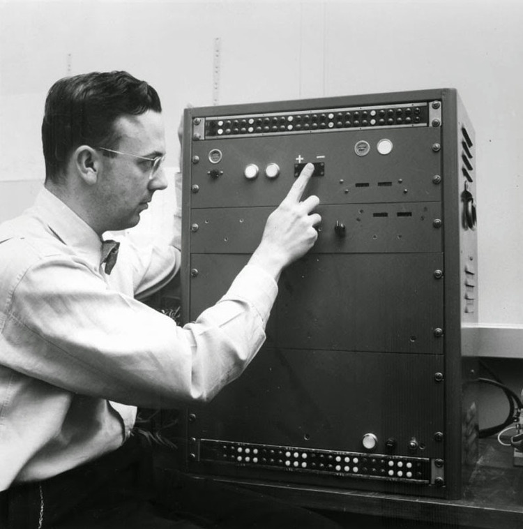
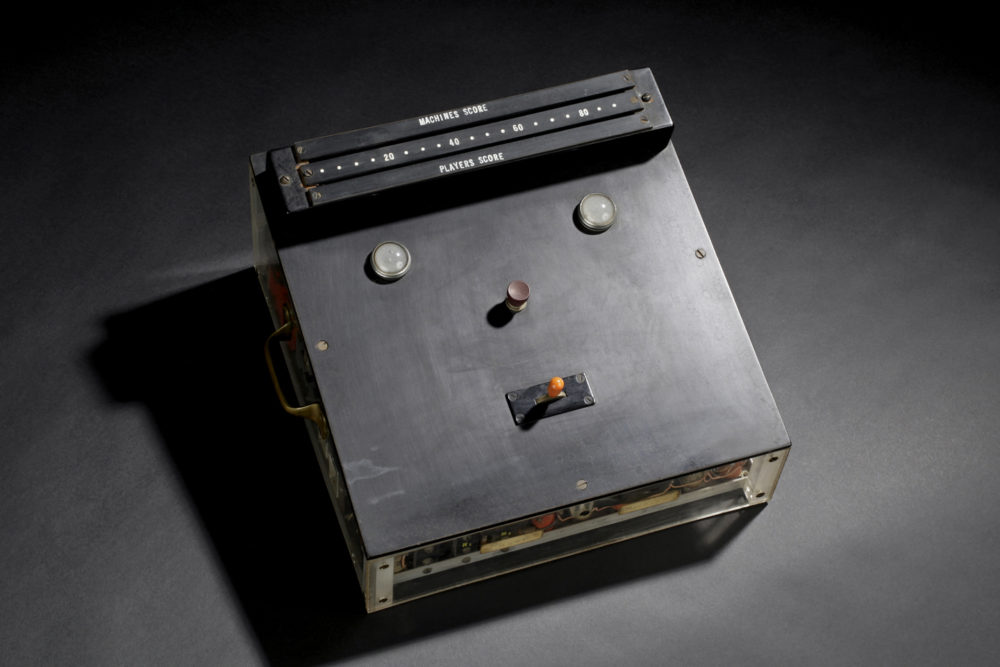

# arduino-mind-reading-machine
An implementation of a "mind-reading machine", based on the work of Claude Shannon and D. W. Hagelbarger in the early 1950s.

The machine plays a game of "matching pennies" against a human opponent. To play, the player would have to say out loud either "right" or "left". The button in the centre of the machine would then be pressed, and either the right or left light would be illuminated. If the light matched the player's choice, the machine wins a point, otherwise the player wins a point. The player then moved the switch in the direction corresponding to the chocie she made.

The machine looks for certain types of patterns in the behavior of the human player. When it finds these patterns, it remembers them and assumes that the player will follow the same patterns the next time the same situation arises. The machine also contains a random element. Until patterns have been found, or if an assumed pattern is not repeated at least twice by the player, the machine makes a choice at random.
